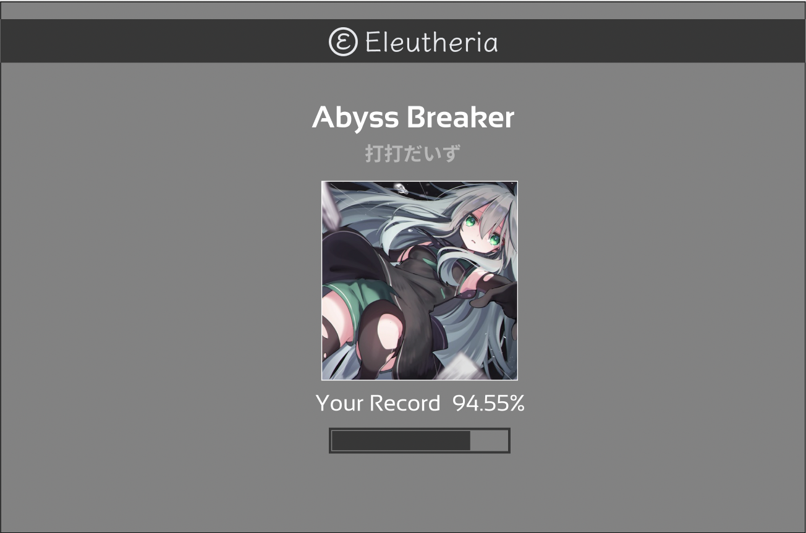

<!-- metadata_start
Title: Designing a Great Loading Screen
Description: Web based games need to deal with poor network conditions. A good loading screen can greatly improve the experience in this regard.
Date: 2022/11/04
Category: Design
metadata_end -->

###### Fri, November 4, 2022

# Designing a Great Loading Screen

During the early stages of development of Eleutheria, I developed and tested everything locally - no latency! Once I set up my production environment, I realized things felt very janky. I hadn't considered latency at all - in other words, how the interface would look and behavior before all the assets were fully loaded. 

This is a fairly big problem, since I am using `wav` files. `wav` is great for a rhythm game, since it's a lossless format, but a 2 minute `wav` file is usually around 50 MB. Ideally, I'll detect network conditions before loading and serve a smaller, compress file for users with limited download speeds. In the meantime, having nice loading screens can alleviate a lot of the jankiness, and make the product feel much more polished.

## Requirements

I think a good loading screen should have several elements:

1. It should be *obvious* something is happening, and how much longer the user needs to wait.
2. Show some useful/interesting animations or information .
3. Be subtle and stay out of the way - the loading screen should have as little screen time as possible.

## Existing Literature

Let's take a look at some other rhythm games, and see how they handle this issue. Even rhythm games that run entirely locally with not latency have some kind of animation to transition between screens. This makes it far much less jarring and like a more cohesive experience.

Here is the DDR A loading screen:

<video controls>
  <source src="ddr-loading.mov" type="video/mp4">
</video>

It shows some useful information - the song you've selected, and your personal best. The transition from loading screen to gameplay is obvious. It also has a loading bar that says "connecting" above it in the lower middle of the screen, but it's very subtle.

One more example is Bemuse:

<video controls>
  <source src="bemuse-loading.mov" type="video/mp4">
</video>

 This one is closer to Eleutheria - it's a web based game, and has to deal with latency. In the bottom left border, it has some progress bars. These serve to inform the user that something is happening, and how much longer they need to wait.

I'd like to incorporate elements from both screens.

- Show the player's high score
- Show the song was selected
- Show a progress bar
- Smooth transitions (fades or animations)

## Proof of Concept

I put together a fairly simple loading screen containing all the information I wanted:

This will probably change in the future, but it'll do for now. It looks fine and fits in with the rest of the game, but doesn't *feel* great:

<video controls>
  <source src="loading-1.mov" type="video/mp4">
</video>

The problem is it's too static - it needs a transition animation. A good loading screen should bridge the gap between two screens - right now, I'm just got two screens (song select and gameplay) with an awkward third screen in between.

Luckily, there are a lot of resources out there for building great transitions for the web. Makes sense - basically every web application has some kind of data fetching or loading step, so loading animations and transitions are common and well defined by this point.

## Adding a Transition

I did some research and found a bunch of [nice transitions](https://speckyboy.com/page-transition-effects/). A lot of these are elaborate for the sake of it, though - the transitions *are* the feature. We want our loading screen to be subtle and stay out of the way. 

I did some more research and found the minimal theme for StepMania, Simply Love, has a subtle top-to-bottom fade effect that works well:

<video controls>
  <source src="loading-simply-love.mov" type="video/mp4">
</video>

I combined this with: 

- a slighty darker background 
- fade in animation for the song banner
- fade out when loading is completed

... and suddenly things look a whole lot nicer!

<video controls>
  <source src="loading-animation.mov" type="video/mp4">
</video>